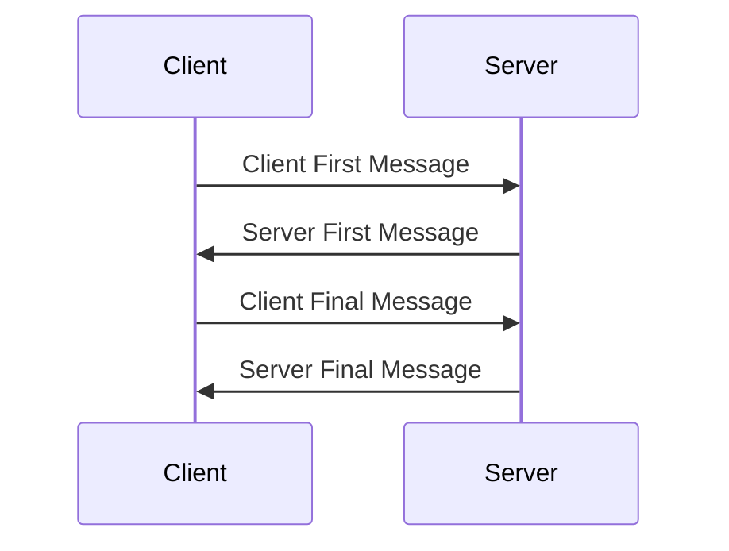

## SCRAM

## Detailed Steps and Data Structures
| Variable | Description |
|----------|-------------|
| $\color{#C3B1E1}{SaltedPassword}$ | Password after PBKDF2 processing |
| $\color{#B8CC44}{ClientKey}$ | Key derived from SaltedPassword for client |
| $\color{#EE6666}{StoredKey}$ | Hashed ClientKey stored on server |
| $\color{orange}{ClientSignature}$ | HMAC of StoredKey and AuthMessage |
| $\color{#935116}{ClientProof}$ | XOR of ClientKey and ClientSignature |
| $\color{green}{AuthMessage}$ | Concatenated authentication messages |
| $\color{cyan}{ServerKey}$ | Key derived from SaltedPassword for server |
| $\color{#DD6F3D}{ServerSignature}$ | Final server verification value |

Key Operations:
| Operation | Description |
|-----------|-------------|
| PBKDF2 | Password-Based Key Derivation Function |
| HMAC | Hash-based Message Authentication Code |
| Hash | One-way hash function |
| XOR | Exclusive OR operation |

## Detail process
### 1. Client First Message
Field|Dscription
|-|-|
|username|user id
|nonce|Client random string

### 2. Server First Message

| Field | Description 
|-------|-------------
| salt | Stored password salt 
| server-nonce | Server nonce (including client nonce) |
| iteration-count | PBKDF2 iteration count |

### 3. Client Final Message

- Client calculates SaltedPassword using received salt and iteration-count

    $\color{#C3B1E1}{SaltedPassword} \color{white}= PBKDF2(password, salt, iteration\text{-}count)$

    $\color{#B8CC44}{ClientKey} \color{white} = HMAC(\color{#C3B1E1}{SaltedPassword}\color{white}, "Client\ Key")$

    $\color{#EE6666}{StoredKey}\color{white} = Hash(\color{#B8CC44}{ClientKey}\color{white})$

- Calculates ClientSignature and ClientProof

    $\color{orange}{ClientSignature}\color{white} = HMAC(\color{#EE6666}{StoredKey}\color{white}, \color{green}{AuthMessage}\color{white})$

    $\color{#935116}{ClientProof}\color{white} = \color{#B8CC44}{ClientKey} \ \ \color{white} XOR \ \ \color{orange}{ClientSignature}$

    Where 

    $\color{green}{AuthMessage}\color{white} = client\text{-}first\text{-}bare+","+server\text{-}first\text{-}message+","+client\text{-}final\text{-}without\text{-}proof$

| Field | Description 
|-------|-------------
| channel-binding | Channel binding info 
| nonce | Complete nonce value | 
| proof | Client proof |

### 4. Server Final Message

- Server verifies ClientProof
    Verification process:

    The server first repeats the client's calculation process using stored user information:

    $\color{#C3B1E1}{SaltedPassword}\color{white} = PBKDF2(password, salt, iteration\text{-}count)$

    $\color{#B8CC44}{ClientKey}\color{white} = HMAC(\color{#C3B1E1}{SaltedPassword}\color{white}, "Client\ Key")$

    $\color{#EE6666}{StoredKey}\color{white} = Hash(\color{#B8CC44}{ClientKey}\color{white})$

    Then the server calculates ClientSignature:

    $\color{orange}{ClientSignature}\color{white} = HMAC(\color{#EE6666}{StoredKey}\color{white}, \color{green}{AuthMessage}\color{white})$

    Recover ClientKey using received ClientProof:

    $\color{#B8CC44}{ClientKey}\color{white} = \color{#935116}{ClientProof} \ \color{white} XOR \ \ \color{orange}{ClientSignature}$

    IF    $\color{#EE6666}{StoredKey}\color{white} == Hash(\color{#B8CC44}{ClientKey}\color{white})$ THEN SUCESS.
- Calculates ServerKey and ServerSignature

    $\color{cyan}{ServerKey}\color{white} = HMAC(\color{#C3B1E1}{SaltedPassword}\color{white}, "Server\ Key")$

    $\color{#DD6F3D}ServerSignature\color{white} = HMAC(\color{cyan}{ServerKey}\color{white}, \color{green}{AuthMessage}\color{white})$

| Field | Description 
|-------|-------------
| verifier | Server signature 

### 5. Client verify server signature
$\color{#C3B1E1}{SaltedPassword}\color{white} = PBKDF2(password, salt, iteration\text{-}count)$

$\color{cyan}{ServerKey}\color{white} = HMAC(\color{#C3B1E1}{SaltedPassword}\color{white}, "Server\ Key")$

$\color{#DD6F3D}{ExpectedServerSignature}\color{white} = HMAC(\color{cyan}{ServerKey}\color{white}, \color{green}{AuthMessage}\color{white})$

IF
 $\color{#DD6F3D}{ServerSignature} == ExpectedServerSignature$
THEN SUCESS